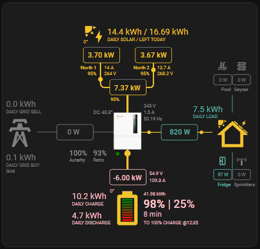
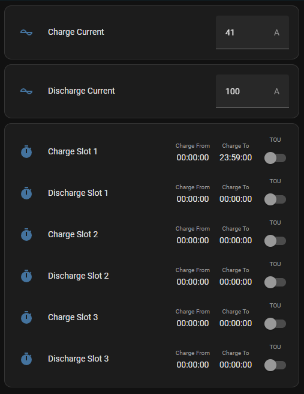
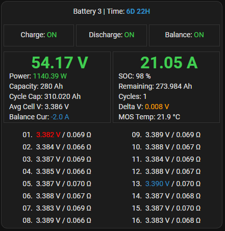

# HH Modbus Control — Home Assistant Integration

> **Multi-brand Modbus inverter integration for Home Assistant.**  
> Supports **Solis**, **Sun-Synk / Deye**, **GivEnergy**, **Sigenergy**, **SolarEdge**, **Skyline**, and **Duracell G3** inverters over TCP or RS485 Serial.

---

## Table of Contents

- [About](#about)
- [Supported Inverters](#supported-inverters)
- [Installation](#installation)
- [Setup & Configuration](#setup--configuration)
- [Platforms & Entities](#platforms--entities)
- [Dashboard Card Examples](#dashboard-card-examples)
- [Tested Hardware](#tested-hardware)
- [Troubleshooting](#troubleshooting)
- [To-Do](#to-do)
- [Roadmap](#roadmap)
- [Contributing](#contributing)

---

## About

**HH Modbus Control** is a Home Assistant custom integration that gives you local, cloud-free control over your solar inverter via Modbus (RS485 or TCP). It was born from the [Solis Modbus](https://github.com/Pho3niX90/solis_modbus) integration and has been re-architected to support multiple inverter brands under a single integration domain (`hh_modbus_control`).

Key design goals:

- **Multi-brand** — Solis, Sun-Synk / Deye, GivEnergy, Sigenergy, SolarEdge, Skyline, and Duracell G3 supported.
- **Efficient polling** — groups contiguous registers into bulk reads to minimise bus traffic.
- **Resilient** — automatic bad-register isolation and recovery, startup staggering for shared connections.
- **Local-first** — no cloud account required; works entirely on your LAN.

> **Note — Solis cloud access:** connecting via RS485 directly to your inverter does not affect the Solis cloud app. If you use the S2 WiFi dongle for *both* Modbus and cloud you may need to temporarily disable Modbus during Solis firmware updates. See [Solis Modbus discussion #154](https://github.com/Pho3niX90/solis_modbus/discussions/154) for details.

---

## Supported Inverters

### Solis

| Model family | Type | Phases |
|---|---|---|
| S6-EH1P | Hybrid | 1 |
| S6-EH2P | Hybrid | 3 |
| S6-EH3P | Hybrid | 3 |
| S6-EO1P | Hybrid | 1 |
| S6-GR1P | Grid-tie | 1 |
| S6-EA1P | Energy storage | 1 |
| S6-EH3P10K-H-ZP *(Zonneplan)* | Hybrid | 3 |
| S5-EH1P / S5-EO1P | Hybrid | 1 |
| S5-GR1P / S5-GR3P | Grid-tie | 1 / 3 |
| S5-GC | Grid-tie (commercial) | 3 |
| RHI-1P / RHI-3P / RHI-* | Hybrid | 1 / 3 |
| RAI-* / RAI-3K-48ES-5G | Energy | 1 |
| 3P(3-20)K-4G | Grid-tie | 3 |
| 1P(2.5-6)K-4G | Grid-tie | 1 |
| WAVESHARE *(Waveshare dongle variant)* | Hybrid | 3 |

See the [Solis sensor reference](docs/source/sensors.md) for full register details.

### Sun-Synk / Deye

| Model | Phases |
|---|---|
| SUN-5K-SG01LP1 | 1 |
| SUN-8K-SG01LP1 | 1 |
| SUN-5K-SG01LP1-AU | 1 |
| SUN-6K-OG01LP1 | 1 |
| DEYE-5K-SG01LP1 | 1 |
| DEYE-8K-SG01LP1 | 1 |

See the [Sun-Synk setup guide](docs/source/sunsynk.md) for register details and configuration notes.

### GivEnergy

*Credit: [cdpuk/givenergy-local](https://github.com/cdpuk/givenergy-local)*

| Model | Phases | Default Port |
|---|---|---|
| GivEnergy-Hybrid-1P | 1 | 8899 |
| GivEnergy-Hybrid-3P | 3 | 8899 |
| GivEnergy-AC-Coupled | 1 | 8899 |

> **Note — Port 8899:** GivEnergy inverters use TCP port **8899** instead of the standard 502. Gen 3 inverters support standard Modbus TCP framing. Gen 1/2 may use a proprietary framing layer that requires the upstream `givenergy-local` integration.

See the [GivEnergy setup guide](docs/source/givenergy.md) for full details.

### Sigenergy

*Credit: [TypQxQ/Sigenergy-Local-Modbus](https://github.com/TypQxQ/Sigenergy-Local-Modbus)*

| Model | Phases |
|---|---|
| Sigenergy-5K | 1 |
| Sigenergy-8K | 1 |
| Sigenergy-10K | 3 |
| Sigenergy-15K | 3 |
| Sigenergy-20K | 3 |

See the [Sigenergy setup guide](docs/source/sigenergy.md) for register details.

### SolarEdge

*Credit: [binsentsu/home-assistant-solaredge-modbus](https://github.com/binsentsu/home-assistant-solaredge-modbus)*

| Model | Phases | Default Port |
|---|---|---|
| SolarEdge-Single-Phase | 1 | 1502 |
| SolarEdge-Three-Phase | 3 | 1502 |
| SolarEdge-StorEdge | 1 | 1502 |
| SolarEdge-StorEdge-3P | 3 | 1502 |

> **Note — Port 1502:** SolarEdge inverters use Modbus TCP on port **1502** (not 502). Registers follow the SunSpec standard.

See the [SolarEdge setup guide](docs/source/solaredge.md) for register details.

### Skyline

*Credit: [iPeel/HA-Skyline](https://github.com/iPeel/HA-Skyline)*

| Model | Phases |
|---|---|
| Skyline-3K | 1 |
| Skyline-5K | 1 |
| Skyline-6K | 3 |
| Skyline-10K | 3 |

See the [Skyline setup guide](docs/source/skyline.md) for register details.

### Duracell G3

*Credit: [iPeel/HA-Skyline](https://github.com/iPeel/HA-Skyline) — with modifications for the Duracell G3 rebranded inverter*

The Duracell G3 is a rebranded Skyline inverter. It shares the same Modbus register map, with the exception that the DCDC software version register is unpopulated on Duracell G3 units.

| Model | Phases |
|---|---|
| Duracell-G3-3K | 1 |
| Duracell-G3-5K | 1 |
| Duracell-G3-6K | 3 |
| Duracell-G3-10K | 3 |

See the [Skyline setup guide](docs/source/skyline.md) for wiring and configuration details (also applies to Duracell G3).

### Fox ESS

> **⚠️ Not currently supported as a Modbus integration.**  
> The [macxq/foxess-ha](https://github.com/macxq/foxess-ha) integration uses the Fox ESS **cloud REST API** (not local Modbus). Local Modbus support for Fox ESS is on the roadmap.

---

## Installation

### HACS (Recommended)

[](https://my.home-assistant.io/redirect/hacs_repository/?owner=ZaviiNet&repository=HH-Modbus&category=integration)

1. Open **HACS** in your Home Assistant instance.
2. Click the **⋮** (three-dot) menu → **Custom Repositories**.
3. Add `https://github.com/ZaviiNet/HH-Modbus` as an **Integration**.
4. Search for **HH Modbus Control** and click **Download**.
5. Restart Home Assistant.

### Manual Installation

1. Download or clone this repository.
2. Copy the `custom_components/hh_modbus_control` folder into your HA `custom_components/` directory.
3. Restart Home Assistant.

---

## Setup & Configuration

1. Go to **Settings → Devices & Services → + Add Integration**.
2. Search for **HH Modbus Control**.
3. Follow the three-step wizard:

### Step 1 — Select Inverter Brand

Choose **Solis**, **Sun-Synk / Deye**, **GivEnergy**, **Sigenergy**, **SolarEdge**, **Skyline**, or **Duracell G3**.

### Step 2 — Select Connection Method

| Option | When to use |
|---|---|
| **TCP (WiFi Dongle)** | S2_WL_ST, Waveshare RS485-to-TCP, or any Modbus-TCP adapter |
| **Serial (RS485)** | USB↔RS485 adapter plugged into the HA host (e.g. [Waveshare USB to RS485](docs/source/waveshare-usb-rs485.md)) connected directly to the inverter's RS485 terminals |

### Step 3 — Inverter Configuration

| Field | Required | Notes |
|---|---|---|
| Inverter Serial | ✅ Yes | Printed on the inverter label; used to generate stable entity IDs |
| Modbus Slave ID | ✅ Yes | Default `1`; check your inverter docs if unsure |
| Inverter Model | ✅ Yes | Select from the dropdown |
| IP Address / Port | TCP only | Default port `502` (GivEnergy: `8899`, SolarEdge: `1502`) |
| Serial Port | Serial only | e.g. `/dev/ttyUSB0` — see [Waveshare USB to RS485 guide](docs/source/waveshare-usb-rs485.md) |
| Baud Rate | Serial only | Default `9600` |
| Fast / Normal / Slow Poll Interval | No | Controls update frequency (seconds) |
| Has PV / Battery / Generator … | Solis only | Enable only the hardware you have |
| WiFi Dongle Type | Solis TCP only | `S2_WL_ST` (default) or `WAVESHARE` |

> **Tip — Total / Daily Energy Sensors:** inverter-reported daily totals can reset slightly before midnight if the inverter clock drifts. Consider adding a [Home Assistant Utility Meter](https://www.home-assistant.io/integrations/utility_meter/) for accurate daily accounting.

> **Waveshare note:** If you use a Waveshare dongle select **WAVESHARE** as the WiFi Dongle Type; some sensors report values at a different scale. See the [sensor reference](docs/source/sensors.md#waveshare).

---

## Platforms & Entities

| Platform | Solis | Sun-Synk | GivEnergy | Sigenergy | SolarEdge | Skyline / Duracell G3 |
|---|---|---|---|---|---|---|
| `sensor` | ✅ All read-only registers | ✅ All input registers | ✅ Live & energy sensors | ✅ Plant-level sensors | ✅ SunSpec sensors | ✅ Power, battery, grid sensors |
| `number` | ✅ Editable holding registers | ✅ Editable holding registers | ❌ *(planned)* | ❌ *(planned)* | ❌ *(planned)* | ❌ *(planned)* |
| `switch` | ✅ Bit-level switches (TOU, modes …) | ❌ *(planned)* | ❌ *(planned)* | ❌ *(planned)* | ❌ *(planned)* | ❌ *(planned)* |
| `time` | ✅ Charge / Discharge time slots | ❌ *(planned)* | ❌ *(planned)* | ❌ *(planned)* | ❌ *(planned)* | ❌ *(planned)* |
| `select` | ✅ Work Mode, Force Charge/Discharge … | ❌ *(planned)* | ❌ *(planned)* | ❌ *(planned)* | ❌ *(planned)* | ❌ *(planned)* |

Services available from **Developer Tools → Services**:

| Service | Description |
|---|---|
| `hh_modbus_control.write_holding_register` | Write a raw value to any holding register |
| `hh_modbus_control.set_time` | Update a time-slot entity by entity ID |

---

## Dashboard Card Examples

### Solar Power Flow Card

Requires the [sunsynk-power-flow-card](https://github.com/slipx06/sunsynk-power-flow-card) HACS frontend card.



```yaml
type: custom:sunsynk-power-flow-card
view_layout:
  grid-area: flow
cardstyle: lite
large_font: true
show_solar: true
panel_mode: true
card_height: 415px
inverter:
  model: solis
  modern: false
  colour: '#959595'
  autarky: 'no'
solar:
  mppts: 2
  show_daily: false
  colour: '#F4C430'
  animation_speed: 9
  max_power: 9600
  pv1_name: West
  pv2_name: North
battery:
  energy: 14280
  shutdown_soc: 20
  show_daily: true
  colour: pink
  animation_speed: 6
  max_power: 6000
load:
  show_aux: false
  show_daily: true
  animation_speed: 8
  max_power: 6000
  additional_loads: 2
  load2_name: Geyser
  load2_icon: mdi:heating-coil
  load1_name: Pool
  load1_icon: mdi:pool
grid:
  show_daily_buy: true
  no_grid_colour: red
  animation_speed: 8
  max_power: 6000
  invert_grid: true
entities:
  dc_transformer_temp_90: sensor.solis_temperature
  day_battery_charge_70: sensor.solis_today_battery_charge_energy
  day_battery_discharge_71: sensor.solis_today_battery_discharge_energy
  day_load_energy_84: sensor.solis_today_energy_consumption
  day_grid_import_76: sensor.solis_today_energy_imported_from_grid
  day_grid_export_77: sensor.solis_today_energy_fed_into_grid
  day_pv_energy_108: sensor.solis_pv_today_energy_generation
  inverter_voltage_154: sensor.solis_a_phase_voltage
  load_frequency_192: sensor.solis_grid_frequency
  inverter_current_164: sensor.solis_a_phase_current
  inverter_power_175: sensor.solis_backup_load_power
  grid_power_169: sensor.solis_ac_grid_port_power
  battery_voltage_183: sensor.solis_battery_voltage
  battery_soc_184: sensor.solis_battery_soc
  battery_power_190: sensor.solis_battery_power
  battery_current_191: sensor.solis_battery_current
  essential_power: sensor.solis_backup_load_power
  grid_ct_power_172: sensor.solis_meter_total_active_power
  pv1_voltage_109: sensor.solis_dc_voltage_1
  pv1_current_110: sensor.solis_dc_current_1
  pv1_power_186: sensor.solis_dc_power_1
  pv2_power_187: sensor.solis_dc_power_2
  pv_total: sensor.solis_total_dc_output
  pv2_voltage_111: sensor.solis_dc_voltage_2
  pv2_current_112: sensor.solis_dc_voltage_2
  grid_voltage: sensor.solis_a_phase_voltage
  battery_current_direction: sensor.solis_battery_current_direction
  inverter_status_59: sensor.solis_current_status
  remaining_solar: sensor.solcast_pv_forecast_forecast_remaining_today
```

*Card layout inspired by [Sunsynk Home Assistant Dash](https://github.com/slipx06/Sunsynk-Home-Assistant-Dash).*

---

### Charge / Discharge Settings Card

Requires the [multiple-entity-row](https://github.com/benct/lovelace-multiple-entity-row) frontend card.



```yaml
type: vertical-stack
cards:
  - type: horizontal-stack
    cards:
      - type: entities
        entities:
          - entity: number.solis_time_charging_charge_current
            name: Charge Current
        state_color: true
  - type: horizontal-stack
    cards:
      - type: entities
        entities:
          - entity: number.solis_time_charging_discharge_current
            name: Discharge Current
        state_color: true
  - type: entities
    entities:
      - entity: switch.solis_time_of_use_mode
        type: custom:multiple-entity-row
        name: Charge Slot 1
        toggle: true
        state_header: TOU
        state_color: true
        icon: mdi:timer
        entities:
          - entity: time.solis_time_charging_charge_start_slot_1
            name: Charge From
          - entity: time.solis_time_charging_charge_end_slot_1
            name: Charge To
      - entity: switch.solis_time_of_use_mode
        type: custom:multiple-entity-row
        name: Discharge Slot 1
        toggle: true
        state_header: TOU
        state_color: true
        icon: mdi:timer
        entities:
          - entity: time.solis_time_charging_discharge_start_slot_1
            name: Charge From
          - entity: time.solis_time_charging_discharge_end_slot_1
            name: Charge To
      - entity: switch.solis_time_of_use_mode
        type: custom:multiple-entity-row
        name: Charge Slot 2
        toggle: true
        state_header: TOU
        state_color: true
        icon: mdi:timer
        entities:
          - entity: time.solis_time_charging_charge_start_slot_2
            name: Charge From
          - entity: time.solis_time_charging_charge_end_slot_2
            name: Charge To
      - entity: switch.solis_time_of_use_mode
        type: custom:multiple-entity-row
        name: Discharge Slot 2
        toggle: true
        state_header: TOU
        state_color: true
        icon: mdi:timer
        entities:
          - entity: time.solis_time_charging_discharge_start_slot_2
            name: Charge From
          - entity: time.solis_time_charging_discharge_end_slot_2
            name: Charge To
      - entity: switch.solis_time_of_use_mode
        type: custom:multiple-entity-row
        name: Charge Slot 3
        toggle: true
        state_header: TOU
        state_color: true
        icon: mdi:timer
        entities:
          - entity: time.solis_time_charging_charge_start_slot_3
            name: Charge From
          - entity: time.solis_time_charging_charge_end_slot_3
            name: Charge To
      - entity: switch.solis_time_of_use_mode
        type: custom:multiple-entity-row
        name: Discharge Slot 3
        toggle: true
        state_header: TOU
        state_color: true
        icon: mdi:timer
        entities:
          - entity: time.solis_time_charging_discharge_start_slot_3
            name: Charge From
          - entity: time.solis_time_charging_discharge_end_slot_3
            name: Charge To
    state_color: true
view_layout:
  grid-area: a
```

---

### JK BMS Card

[](https://github.com/Pho3niX90/jk-bms-card)

Get the card: <https://github.com/Pho3niX90/jk-bms-card>

---

## Tested Hardware

### Solis Inverters

Tested with Solis and equivalent Axitec / Zonneplan inverters.

| Model | Notes |
|---|---|
| S6-EH3P20K-H | [#93](https://github.com/Pho3niX90/solis_modbus/issues/93) |
| S6-EH3P15K-H | — |
| S6-EH3P(12-20)K-H | — |
| S6-EH1P6K-L-PRO | — |
| S6-EH1P6K-L-PLUS | — |
| S6-EH3P10K-H-ZP | [#191](https://github.com/Pho3niX90/solis_modbus/issues/191) |
| S6-EH3P10K-H-EU | [#202](https://github.com/Pho3niX90/solis_modbus/issues/202) |
| S6-GR1P4K | [#84](https://github.com/Pho3niX90/solis_modbus/issues/84) |
| S5-EH1(3-6)K-L | [#89](https://github.com/Pho3niX90/solis_modbus/issues/89) |
| S5-EH1P5K-L | [#94](https://github.com/Pho3niX90/solis_modbus/issues/94) |
| S5-EH1P6K-L | [#94 comment](https://github.com/Pho3niX90/solis_modbus/issues/94#issuecomment-2656512651) |
| S5-GC30K | [#173](https://github.com/Pho3niX90/solis_modbus/issues/173) |
| S5-GC60K | [#180 comment](https://github.com/Pho3niX90/solis_modbus/issues/180#issuecomment-2887414843) |
| RAI-3K-48ES-5G | [#174](https://github.com/Pho3niX90/solis_modbus/issues/174) |
| RHI-3K-48ES-5G | [#97 comment](https://github.com/Pho3niX90/solis_modbus/issues/97#issuecomment-2639807764) |
| 3P6K-4G | [#210](https://github.com/Pho3niX90/solis_modbus/issues/210) |
| 1P(2.5-6)K-4G | [#230](https://github.com/Pho3niX90/solis_modbus/issues/230) |

### Sun-Synk / Deye Inverters

Sun-Synk support is new. Community testing reports welcome — please open an issue if your model works or needs adjustments.

### WiFi Dongles / TCP Adapters

- S2_WL_ST (default)
- Waveshare RS485-to-TCP

### USB↔RS485 Serial Adapters

- **Waveshare USB to RS485 Industrial Converter** (FT232RL) — plug-and-play on Linux / Home Assistant OS; appears as `/dev/ttyUSB0`. See the [Waveshare USB to RS485 guide](docs/source/waveshare-usb-rs485.md) for full wiring and setup instructions.

---

## Troubleshooting

### Connection fails during setup

- Confirm the inverter IP / serial port is reachable from the Home Assistant host.
- Check that no other application (e.g. the Solis cloud dongle) is holding the RS485 bus exclusively.
- For TCP: verify port `502` is open (or use the port shown in your dongle's settings).
- Increase the **Modbus Slave ID** timeout if you have a slow connection.

### Sensors show "Unavailable"

- Check HA logs (`Settings → System → Logs`) for `hh_modbus_control` errors.
- The integration automatically isolates bad registers and continues polling the rest. If a specific sensor is consistently unavailable, open an issue with your inverter model and the relevant log lines.

### Restoring Sensor History after Entity ID Change

If an entity ID changed (e.g. after reconfiguring the Inverter Serial) and you want to recover historical data:

1. Navigate to **Developer Tools → Statistics**.
2. Search for the sensor name (e.g., "Battery SOC").
3. Identify the **current** (working) and **historic** (old) entries.
4. Click the current sensor → gear icon → rename its **Entity ID** to the old one.

Alternatively, the [HA Merge Sensor History](https://github.com/mayerwin/HA-Merge-Sensor-History) integration automates this.

#### ⚠️ Reconfiguration note

If the reconfiguration flow does not prompt for an **Inverter Serial**, delete the device and re-add it fresh.

> **Tip:** Rename the new device to match your old device name, then choose **"Recreate Entity IDs"** to preserve dashboard and history linkage.

---

## To-Do

- [ ] Sun-Synk `switch`, `time`, and `select` platform entities (charge/discharge scheduling)
- [ ] HACS-compatible `hacs.json` metadata update for `hh_modbus_control`
- [ ] Automated integration tests for Sun-Synk sensor data parsing
- [ ] Docs site rebuild at a new URL (moving away from solis-modbus.readthedocs.io)
- [ ] Validate Sun-Synk 3-phase models
- [ ] Service call UI descriptions for Sun-Synk time slots

---

## Roadmap

The HH Modbus Control integration is being designed as a single, extensible platform for **any Modbus-speaking solar inverter**. Planned brand support (subject to community contribution and hardware availability):

| Brand | Status |
|---|---|
| **Solis** | ✅ Fully supported |
| **Sun-Synk / Deye** | 🔄 Sensor + Number entities (schedule control coming) |
| **Growatt** | 🗓️ Planned |
| **Goodwe** | 🗓️ Planned |
| **Huawei SUN2000** | 🗓️ Planned |
| *Other brands* | 🤝 Community contributions welcome |

If you would like to add support for your inverter, see [CONTRIBUTING.md](CONTRIBUTING.md) and open an issue describing your hardware and available Modbus register map.

---

## Contributing

Contributions are welcome! Please read [CONTRIBUTING.md](CONTRIBUTING.md) before submitting a pull request.

Quick-start for local development:

```bash
# Install uv (https://docs.astral.sh/uv/)
uv sync

# Lint
uv run ruff check

# Format
uv run ruff format

# Test
uv run pytest
```

